# SvelteKit Markdown Blog (Premium FUI & AI)

> **Proje Kodu:** P16 · **Zorluk:** Orta-Zor · **Puan:** 50 · **Hafta:** 2

**Öğrenci:** BATUHAN ASLAN  
**Öğrenci No:** 24080410010  
**E-posta:** batu99964@gmail.com  
**Ders:** BMU1208 Web Tabanlı Programlama — *Dr. Öğr. Üyesi Davut ARI*  
**Kurum:** Bitlis Eren Üniversitesi — Mühendislik-Mimarlık Fakültesi — Bilgisayar Mühendisliği  
**Dönem:** 2025-2026 Bahar  

---

## İçindekiler

1. [Proje Künyesi](#1-proje-künyesi)
2. [Executive Summary](#2-executive-summary)
3. [Problem ve Motivasyon](#3-problem-ve-motivasyon)
4. [Hedef Kitle ve Persona](#4-hedef-kitle-ve-persona)
5. [Ürün Gereksinimleri (PRD)](#5-ürün-gereksinimleri-prd)
6. [Piyasa ve Rekabet Analizi](#6-piyasa-ve-rekabet-analizi)
7. [Teknoloji Yığını (Tech Stack)](#7-teknoloji-yığını-tech-stack)
8. [Sistem Mimarisi](#8-sistem-mimarisi)
9. [Veri Modeli ve API Tasarımı](#9-veri-modeli-ve-api-tasarımı)
10. [UI/UX Tasarımı](#10-uiux-tasarımı)
11. [Güvenlik, Performans, Test](#11-güvenlik-performans-test)
12. [Ekran Görüntüleri](#12-ekran-görüntüleri)

---

## 1. Proje Künyesi

| Alan | Değer |
|------|-------|
| Proje Adı | RB Blog — SvelteKit Premium FUI Blog Engine |
| Proje Kodu | P16 |
| Slogan | *Sıradan bir okuma deneyiminin ötesinde: Siber-uzayda interaktif bir bilgi ağı.* |
| Kategori | Blog / Content Platform / AI SaaS |
| Hedef Platform | Web (Responsive — Desktop & Mobile) |
| Lisans | MIT |
| Durum | 🟢 Geliştirme Tamamlandı |
| Repository | `24080410010-P16-sveltekit-markdown-blog` |

### Tech Stack Özeti

| Katman | Teknolojiler |
|--------|--------------|
| Framework | SvelteKit 2 + Svelte 5 (Runes) |
| Styling | Tailwind CSS 4, Vanilla CSS |
| Etkileşim | Svelte Runes (`$state`, `$derived`, `$props`) |
| AI API | Google Gemini 2.5 Flash |
| Backend-as-a-Service | Supabase (Auth + PostgreSQL) |
| Syntax Highlight | Shiki |
| İçerik | MDsveX (Markdown + Svelte) |

---

## 2. Executive Summary

### 2.1 Ne Yapıyoruz?

**RB Blog**, klasik ve tekdüze blog tasarımlarına karşı geliştirilmiş; **FUI (Futuristic UI)** estetiği ile harmanlanmış, SvelteKit destekli modern bir blog motorudur.

Kullanıcılarına:
- 🎮 **Etkileşimli bir siber deneyim** — custom cursor, ses efektleri, Matrix modu
- 🤖 **Entegre Yapay Zeka Asistanı** — Google Gemini 2.5 Flash destekli RB-AI chatbot
- 📊 **Gerçek Zamanlı Dashboard** — CPU, RAM, BTC/ETH simüle izleme paneli
- 🎨 **Dinamik Tema Sistemi** — 3 farklı FUI teması (Neon Night / Deep Space / Retro Gold)
- ✍️ **Tam Blog CMS** — Supabase + Markdown ile yazı oluşturma, düzenleme, silme

### 2.2 Neden Şimdi?

Modern web kullanıcılarının dikkat süresi giderek kısalmaktadır. Etkileşimli mikro-animasyonlara sahip ve yapay zeka ile desteklenmiş arayüzler, kullanıcı bağlılığını artırmanın en etkili yolu haline gelmiştir. Bu proje, hem teknik yetkinliği hem de yaratıcı tasarımı bir arada sunmaktadır.

---

## 3. Problem ve Motivasyon

### 3.1 Hangi Probleme Çözüm Getiriyoruz?

Günümüzde blog platformları (Medium, Blogger, WordPress) birbirinin kopyası haline gelmiştir:
- Standart beyaz arka plan, standart tipografi
- Sıfır etkileşim, sıfır kişiselleştirme
- Okuyucu sorusuna anında cevap yok — yorum bölümü günlerce bekliyor

### 3.2 Bizim Diferansiyasyonumuz

| Özellik | Klasik Bloglar | RB Blog |
|---------|----------------|---------|
| Tasarım | Sıradan, statik | FUI / Siber-Punk dinamik |
| Yapay Zeka | ❌ Yok | ✅ Gemini 2.5 Flash entegre |
| Tema | 1 veya 2 tema | 3 anlık geçişli FUI teması |
| Cursor | Sistem imleci | Özel Siber İmleç + ses |
| Matrix Modu | ❌ | ✅ Gizli "G" tuşu easter-egg |
| Performance | Sayfalar arası bekleme | SSR + SvelteKit hızı |

---

## 4. Hedef Kitle ve Persona

### 4.1 Birincil Segment

Teknoloji meraklıları, yazılımcılar, siber güvenlik uzmanları ve fütüristik tasarımlara ilgi duyan Z ve Y kuşağı okuyucular.

### 4.2 Persona: "Cyber Coder"

| Alan | Detay |
|------|-------|
| **Yaş** | 20-35 |
| **Rol** | Yazılım Geliştirici / Meraklı Öğrenci |
| **Pain Points** | Sıkıcı eğitim materyalleri, statik dokümantasyonlar, soruya anında cevap bulamama |
| **Beklenti** | Havalı tasarım, hızlı altyapı, okurken sorabileceği bir AI asistan |
| **Platform** | Desktop (öncelikli) + Mobile |

---

## 5. Ürün Gereksinimleri (PRD)

### 5.1 Kapsam (In-Scope — MVP)

1. Animasyonlu ve glitch efektli açılış (Splash) ekranı
2. FUI konseptine uygun custom cursor ve sesli hover efektleri içeren navigasyon
3. 3 farklı temada dinamik değişim (Neon Night, Deep Space, Retro Gold)
4. Google Gemini API entegrasyonu ile RB-AI chatbot
5. SvelteKit sunucu (backend) API rotalarının güvenli kurulumu
6. Supabase Auth ile kullanıcı kayıt/giriş sistemi
7. Blog yazısı oluşturma, düzenleme, silme (CRUD) paneli
8. Arama ve etiket filtreleme sistemi
9. MDsveX ile Markdown yazı desteği
10. Bülten (Newsletter) abonelik formu

### 5.2 Fonksiyonel Gereksinimler

| Kod | Gereksinim |
|-----|------------|
| FR-01 | Kullanıcı ana sayfaya girdiğinde 4 saniyelik FUI splash ekranı görmeli |
| FR-02 | Kullanıcı `[SWAP_THEME]` butonuna tıklayarak renk paletini canlı değiştirebilmeli |
| FR-03 | Kullanıcı RB-AI'a mesaj gönderdiğinde, SvelteKit backend Gemini API'sine güvenli istek atmalı |
| FR-04 | Kayıtlı kullanıcı dashboard'dan blog yazısı oluşturabilmeli |
| FR-05 | Ziyaretçi `/search` üzerinden yazıları arayabilmeli ve etiketlere göre filtreleyebilmeli |
| FR-06 | "G" tuşuna basıldığında Matrix teması aktif olmalı |
| FR-07 | Sol alt köşedeki dashboard CPU/RAM simülasyonu ve BTC/ETH fiyatı göstermeli |

### 5.3 Fonksiyonel Olmayan Gereksinimler

- **Performans:** Lighthouse skoru ≥ 85 (SSR ile)
- **Güvenlik:** API anahtarları backend'de, asla frontend'e sızdırılmaz
- **Responsive:** 390px (mobile) — 1920px (desktop) arası sorunsuz çalışma
- **SEO:** `<svelte:head>` ile her sayfada özel title + description

---

## 6. Piyasa ve Rekabet Analizi

### 6.1 Mevcut Çözümler

| Platform | Güçlü Yönleri | Zayıf Yönleri |
|----------|---------------|----------------|
| **Medium** | Geniş yazar topluluğu | Yavaş, sıradan tasarım, paywall |
| **Ghost** | Hızlı, SEO odaklı | Tasarım özelleştirmesi sınırlı |
| **WordPress** | Esneklik | Ağır, güvenlik açıkları |
| **Hashnode** | Geliştirici odaklı | AI entegrasyonu yok |
| **Dev.to** | Açık kaynak, topluluk | Minimal tasarım |

### 6.2 Bizim Konumlandırmamız

RB Blog, **"Developer Experience + Premium Design + AI Integration"** üçgeninde konumlandırılmaktadır. Hedef kitleye sırf içerik okumak değil; **bir deneyim yaşatmak** sunulur.

```
Tasarım Kalitesi
      ▲
      │         ● RB Blog
      │
      │    ● Ghost    ● Hashnode
      │
      │ ● WordPress
      │         ● Medium
      └─────────────────────► AI Entegrasyonu
```

---

## 7. Teknoloji Yığını (Tech Stack)

### 7.1 SvelteKit 2 & Svelte 5

- **Ne?** Reaktif web uygulamaları için tam yığın framework
- **Neden Seçildi:**
  - Virtual DOM **kullanmaz** — kodları build-time'da saf JS'e derler → rakiplerine göre 2-5x daha hızlı
  - Svelte 5 ile gelen **Runes** (`$state`, `$derived`, `$props`) mimarisi, state yönetimini basit ve güçlü kılar
  - SvelteKit'in SSR + SPA hibrit modeli mükemmel SEO sağlar

### 7.2 TailwindCSS 4

- **Ne?** Utility-first CSS framework
- **Neden Seçildi:** FUI tasarımında yoğun custom gölge (glow), gradient ve geçiş olduğundan HTML içinde hızlı stillendirme kritiktir. Tailwind 4'ün yeni `@theme` direktifi ile CSS değişkenleri doğrudan CSS'e entegre edilir.

### 7.3 Google Gemini 2.5 Flash API

- **Ne?** Google DeepMind'ın en güncel ve hızlı dil modeli
- **Neden Seçildi:** Siber asistan konsepti için akıcı cevap hızı kritik. OpenAI'a kıyasla ücretsiz tier daha cömerttir. SvelteKit `+server.js` rotaları üzerinden Node.js `fetch` ile kolay entegre edilir.

### 7.4 Supabase

- **Ne?** Açık kaynak Firebase alternatifi (PostgreSQL + Auth + Storage)
- **Neden Seçildi:** Kullanıcı kaydı ve blog yazısı persistansı için gerçek bir veritabanı gereklidir. Supabase, SSR uyumlu `@supabase/ssr` paketi ile SvelteKit ile mükemmel çalışır.

### 7.5 MDsveX

- **Ne?** Svelte için Markdown işleyici (MDX benzeri)
- **Neden Seçildi:** Blog içerikleri Markdown formatında tutulur, Shiki ile syntax highlighting sağlanır.

### 7.6 Shiki

- **Ne?** VS Code tabanlı syntax highlighter
- **Neden Seçildi:** Teknik blog içeriklerinde kod blokları kritik öneme sahiptir; Shiki, doğru renkli kod görüntüleme sağlar.

---

## 8. Sistem Mimarisi

### 8.1 Genel Mimari

```
┌─────────────────────────────────────────────────────────┐
│                    CLIENT (Browser)                      │
│  Svelte 5 Components + TailwindCSS + Custom Animations  │
└───────────────────────┬─────────────────────────────────┘
                        │ HTTP / WebSocket
                        ▼
┌─────────────────────────────────────────────────────────┐
│                SvelteKit Server (Node.js)                │
│                                                          │
│  ┌─────────────────┐    ┌──────────────────────────┐   │
│  │  SSR Renderer   │    │  API Routes (+server.js)  │   │
│  │ (+page.server)  │    │  /api/chat  /api/contact  │   │
│  └────────┬────────┘    └──────────┬───────────────┘   │
│           │                        │                     │
└───────────┼────────────────────────┼─────────────────────┘
            │                        │
            ▼                        ▼
┌───────────────────┐    ┌────────────────────────────┐
│     Supabase      │    │   Google Gemini API         │
│  (PostgreSQL+Auth)│    │   (gemini-2.5-flash)        │
└───────────────────┘    └────────────────────────────┘
```

### 8.2 Veri Akışı — AI Chatbot

```
1. Kullanıcı → RB-AI paneline mesaj yazar
2. Client → POST /api/chat { message }
3. SvelteKit Server → ENV'den GEMINI_API_KEY okur
4. Server → Google Gemini API'ye güvenli istek
5. Gemini → Cevap döner
6. Server → Cevabı Client'a iletir
7. Client → CyberAssistant.svelte bileşeninde gösterir
```

### 8.3 Dizin Yapısı

```
repo/
├── src/
│   ├── lib/
│   │   ├── components/
│   │   │   ├── Header.svelte         # FUI navigasyon
│   │   │   ├── Footer.svelte         # Alt bilgi
│   │   │   ├── CyberAssistant.svelte # AI Chatbot bileşeni
│   │   │   ├── PostCard.svelte       # Blog yazısı kartı
│   │   │   └── Newsletter.svelte     # Bülten formu
│   │   ├── server/                   # Server-side yardımcılar
│   │   └── supabaseClient.js         # Supabase bağlantısı
│   ├── posts/                        # Markdown blog yazıları
│   └── routes/
│       ├── +layout.svelte            # Ana layout (FUI, cursor, splash)
│       ├── +page.svelte              # Ana sayfa
│       ├── blog/[slug]/              # Dinamik blog sayfası
│       ├── dashboard/                # Yazar paneli (korumalı)
│       │   ├── +page.svelte          # Yazı listesi
│       │   └── new/                  # Yeni yazı oluşturma
│       ├── login/                    # Giriş sayfası
│       ├── register/                 # Kayıt sayfası
│       ├── search/                   # Arama
│       ├── tags/                     # Etiket listesi
│       ├── contact/                  # İletişim
│       └── api/
│           └── chat/+server.js       # Gemini API proxy
└── static/                           # Statik dosyalar
```

---

## 9. Veri Modeli ve API Tasarımı

### 9.1 Supabase Veritabanı Şeması

#### `profiles` Tablosu
| Kolon | Tip | Açıklama |
|-------|-----|----------|
| `id` | UUID (PK, FK → auth.users) | Kullanıcı ID |
| `username` | TEXT | Kullanıcı adı |
| `avatar_url` | TEXT | Profil fotoğrafı URL |
| `created_at` | TIMESTAMPTZ | Oluşturulma tarihi |

#### `posts` Tablosu
| Kolon | Tip | Açıklama |
|-------|-----|----------|
| `id` | UUID (PK) | Yazı ID |
| `title` | TEXT | Başlık |
| `slug` | TEXT (UNIQUE) | URL-friendly isim |
| `content` | TEXT | Markdown içerik |
| `excerpt` | TEXT | Kısa özet |
| `tags` | TEXT[] | Etiket dizisi |
| `cover_image` | TEXT | Kapak görseli URL |
| `author_id` | UUID (FK → profiles) | Yazar |
| `published` | BOOLEAN | Yayın durumu |
| `created_at` | TIMESTAMPTZ | Oluşturulma |
| `updated_at` | TIMESTAMPTZ | Son güncelleme |

### 9.2 API Rotaları

| Endpoint | Metod | Açıklama | Auth |
|----------|-------|----------|------|
| `/api/chat` | POST | Gemini AI ile sohbet | ❌ Herkese açık |
| `/api/contact` | POST | İletişim formu e-postası | ❌ Herkese açık |
| `/dashboard` | GET | Yazar paneli | ✅ Gerekli |
| `/dashboard/new` | GET/POST | Yeni yazı | ✅ Gerekli |
| `/dashboard/[id]/edit` | GET/PUT | Yazı düzenleme | ✅ Gerekli |

### 9.3 Supabase Row-Level Security (RLS)

```sql
-- Herkes yayınlanmış yazıları okuyabilir
CREATE POLICY "Public posts are viewable by everyone" ON posts
  FOR SELECT USING (published = true);

-- Yalnızca yazar kendi yazısını düzenleyebilir  
CREATE POLICY "Authors can update own posts" ON posts
  FOR UPDATE USING (auth.uid() = author_id);
```

---

## 10. UI/UX Tasarımı

### 10.1 Konsept: Futuristic UI (FUI)

Uygulamanın genelinde **karanlık arka plan üzerine parlayan neon renkler** (cyan `#22d3ee`, mor `#a855f7`, mavi `#3b82f6`) kullanılmıştır.

**Tasarım Prensipleri:**
- 🖥️ Ekran tüketici değil, **aktif katılımcı** hissi
- 🎨 Her etkileşim görsel ve işitsel geri bildirim verir
- 🌙 Karanlık mod birincil, açık mod desteği mevcut

### 10.2 Tema Sistemi

```css
/* Neon Night (Varsayılan) */
[data-cyber-theme="neon-night"] { --primary: #22d3ee; --accent: #a855f7; }

/* Deep Space */
[data-cyber-theme="deep-space"]  { --primary: #818cf8; --accent: #06b6d4; }

/* Retro Gold */
[data-cyber-theme="retro-gold"]  { --primary: #f59e0b; --accent: #ef4444; }
```

### 10.3 Splash Screen (Açılış Ekranı)

- `loading = true` ile başlar, 4 saniye sonra kapanır
- **"RB"** logosu yukarıdan `elasticOut` easing ile düşer
- Glitch animasyonu (`@keyframes glitch`) ile titreşir
- Dijital grid arka planı (`background-image: linear-gradient`) görünür
- "System Initializing..." yazısı ile terminal hissi verir

### 10.4 Micro-Interactions (Mikro Etkileşimler)

| Etkileşim | Açıklama |
|-----------|----------|
| **Custom Cursor** | Sistem imleci gizlendi; yerine cyan nokta + halka |
| **Hover Ses** | Hover'da `playTechSound(800, 'square', 0.03)` |
| **Tıklama Ses** | `onmousedown` → `playTechSound(600, 'sine', 0.1)` |
| **Cursor Expand** | Etkileşimli elemanda `scale-150` ve ping animasyonu |
| **Image Glitch** | Görseller hover'da `glitch-img` + `hue-rotate(90deg)` |
| **Scroll Progress** | Sayfanın üst kısmında neon gradient ilerleme çubuğu |
| **Matrix Easter Egg** | "G" tuşu → Tüm arka plan Matrix yeşiline döner |
| **Notification Toast** | `fly` + `fade` Svelte transition ile sağdan gelen bildirim |

### 10.5 Siber Dashboard (Sol Alt)

- **CPU ve RAM:** Simüle edilmiş bar göstergeleri (2sn'de bir güncellenir)
- **BTC/ETH:** ±50/$10 rastgele dalgalanan fiyatlar
- **SWAP_THEME:** Tek butonla tema döngüsü

### 10.6 RB-AI Asistan (CyberAssistant)

- Sağ alt köşede kayan chat paneli
- Google Gemini 2.5 Flash ile gerçek zamanlı sohbet
- Mesaj geçmişi tutulur, siber hacker temalı UI
- Açma/kapama animasyonu ile compact görünüm

---

## 11. Güvenlik, Performans, Test

### 11.1 Güvenlik

| Risk | Önlem |
|------|-------|
| **API Key Sızdırma** | `$env/static/private` → yalnızca `+server.js`'de kullanılır |
| **XSS** | Svelte varsayılan olarak HTML escape eder |
| **Unauthorized Write** | Supabase RLS politikaları ile satır bazlı erişim kontrolü |
| **CSRF** | SvelteKit form actions varsayılan CSRF koruması |

### 11.2 Performans

- **SSR (Server-Side Rendering):** Her sayfa ilk yüklemede tarayıcıya hazır HTML gönderilir → hızlı FCP (First Contentful Paint)
- **Code Splitting:** SvelteKit her route'u ayrı chunk'a böler → gereksiz JS yüklenmez
- **Svelte Derleme:** Runtime yoktur; tüm reaktivite build aşamasında saf JS'e dönüşür
- **Tailwind Purge:** Kullanılmayan CSS sınıfları production build'de otomatik silinir

### 11.3 Test Yaklaşımı

| Katman | Araç | Kapsam |
|--------|------|--------|
| **Manuel** | Tarayıcı + DevTools | UI etkileşimleri, responsive kontrol |
| **API** | cURL / Postman | `/api/chat` endpoint testi |
| **Auth Flow** | Manuel | Kayıt → Giriş → Dashboard → Çıkış akışı |
| **AI** | Manuel | Gemini entegrasyon doğrulaması |

---

## 12. Ekran Görüntüleri

Bu bölümde projeye ait gerçek ekran görüntüleri yer almaktadır.

### 12.1 UI Ekranları

#### Ana Sayfa (Splash Sonrası)
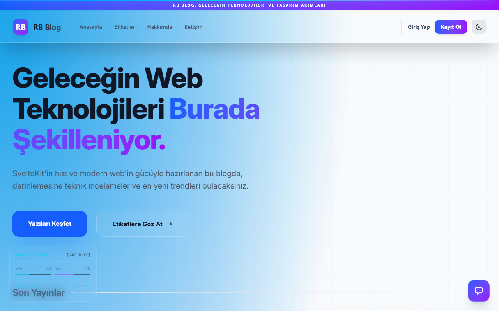

#### Giriş Ekranı
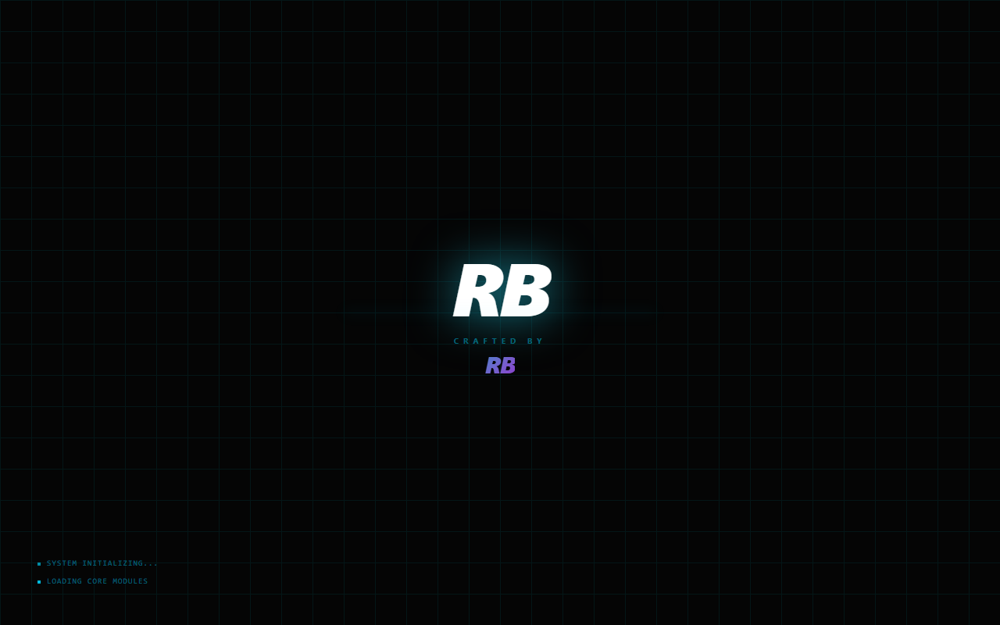

#### Arama / Blog Listesi
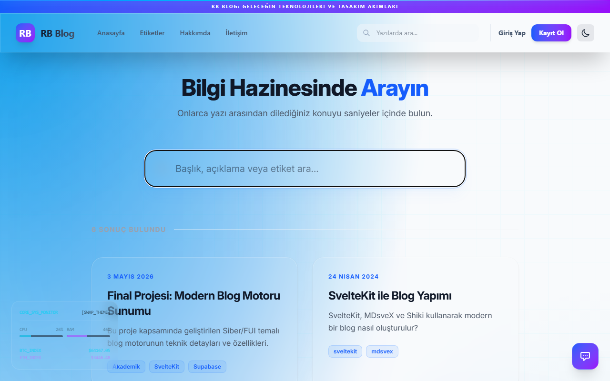

#### Detay Sayfası


#### İletişim Sayfası
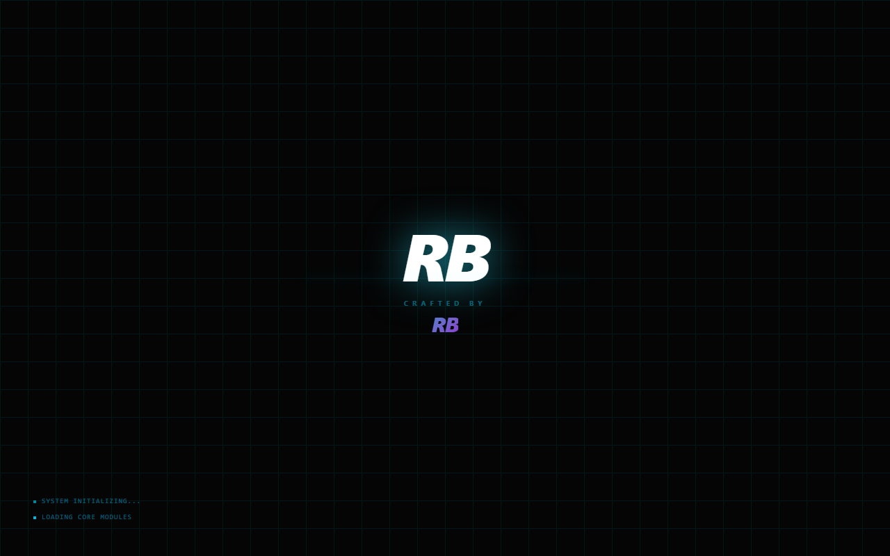

#### Etiketler Sayfası


#### Mobile Görünüm (390px)
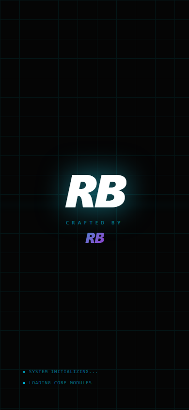

#### 404 Hata Sayfası
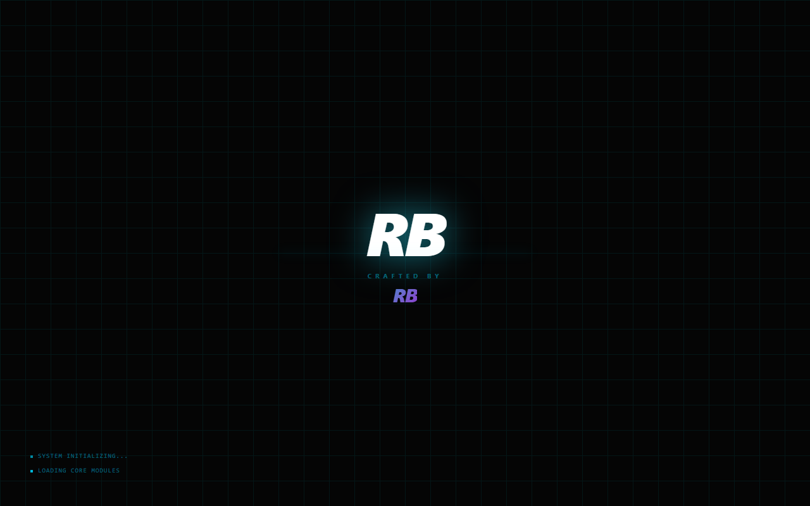

### 12.2 Mimari Diyagramlar

> Aşağıdaki diyagramlar projeye özel olarak üretilmiştir.

#### C4 Context Diyagramı
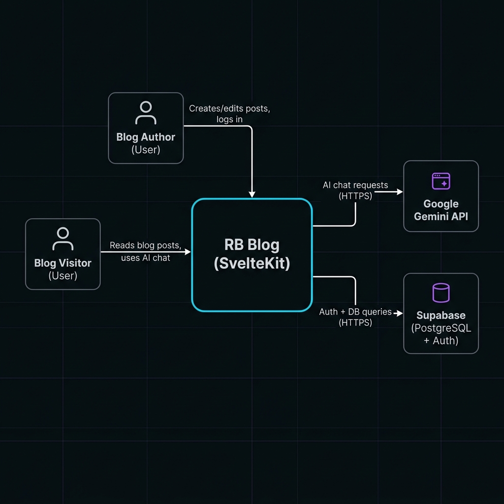

#### C4 Container Diyagramı
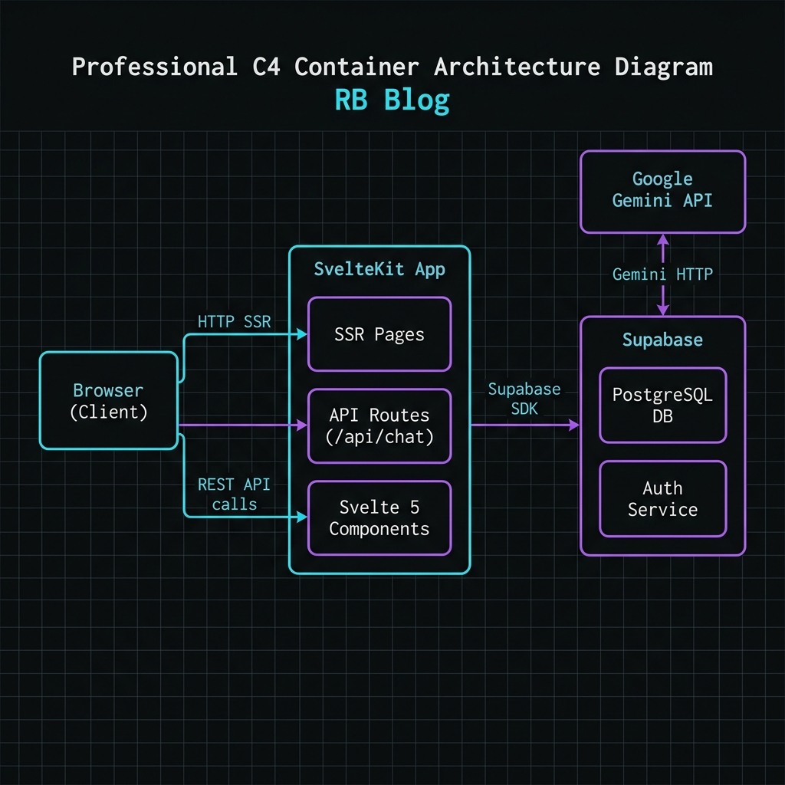

#### Giriş Akışı (Sequence Diagram)
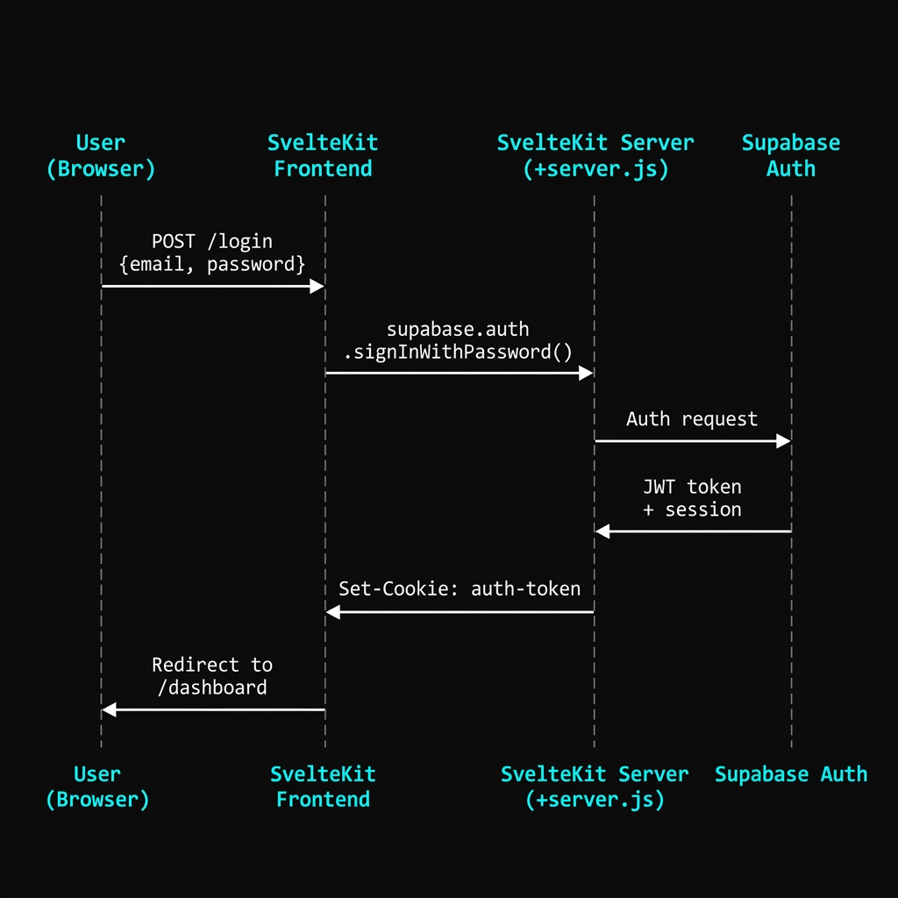

#### Veritabanı ER Diyagramı
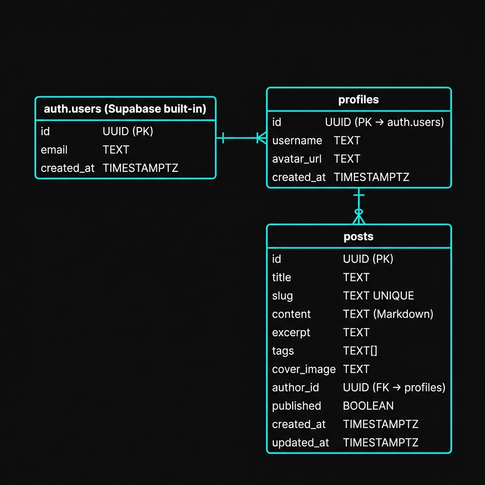

#### Site Haritası
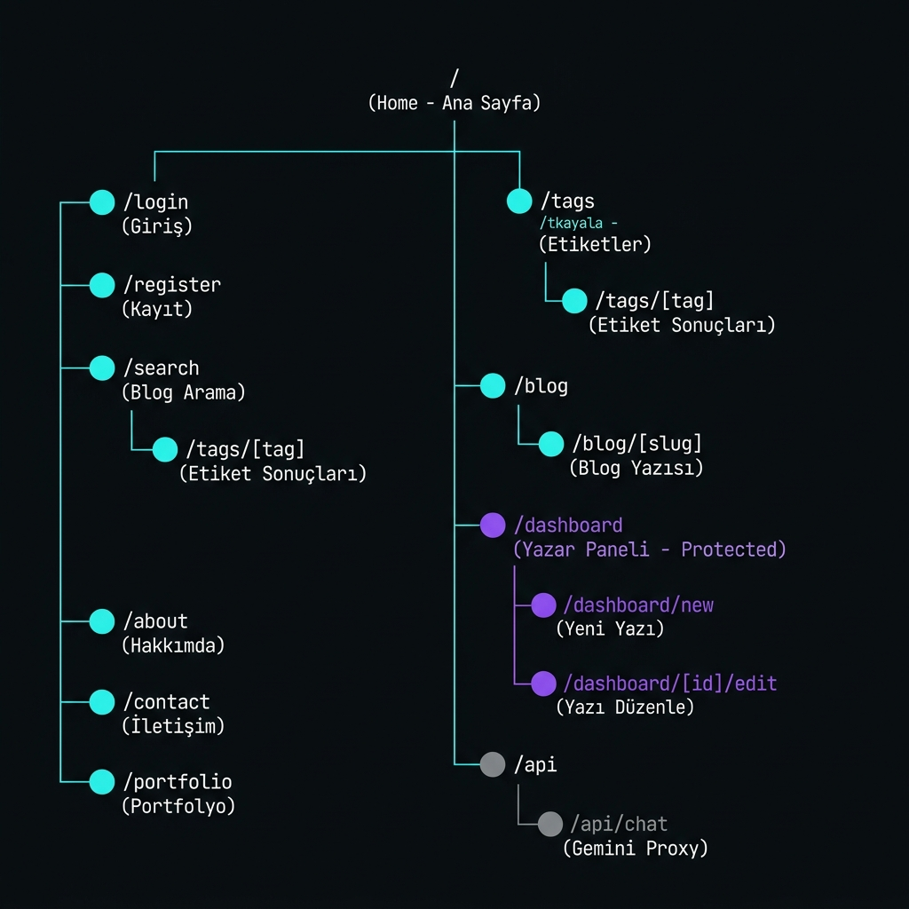

#### Kullanıcı Akışı
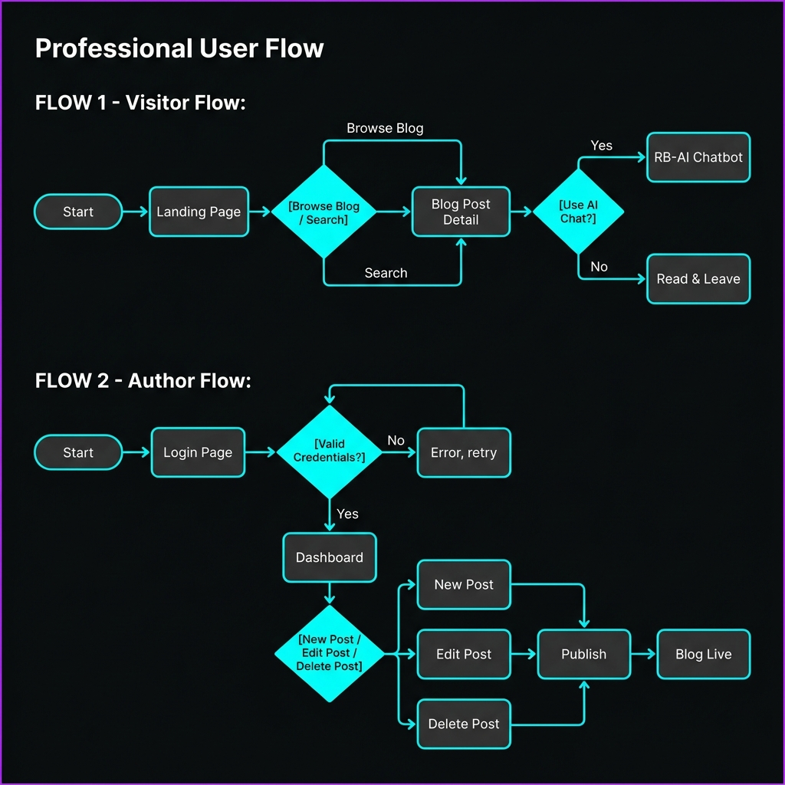

---

*Bu rapor, BMU1208 Web Tabanlı Programlama dersi kapsamında, Bitlis Eren Üniversitesi Bilgisayar Mühendisliği bölümünde hazırlanmıştır.*  
*© 2026 BATUHAN ASLAN — MIT Lisansı*
